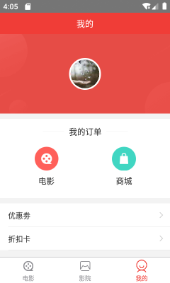
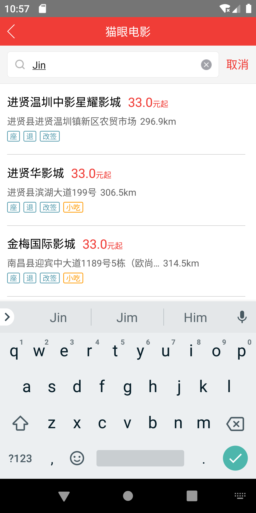

# React Native —— 猫眼电影
本项目是仿造web端猫眼电影，使用React-Native实现的一个安卓项目
## 开发环境
具体开发环境搭建请参照[React-Native官网](https://reactnative.cn/)
## 使用
1. `git clone git@github.com:liaodehui1/android.git`克隆项目到本地
2. `cd MyApp`进入前台目录，然后`yarn install`安装依赖
3. `cd maoyan`进入后台目录，然后`cnpm i`安装依赖
4. `npm start`开启后台
5. 打开模拟器，使用`react-native run-android`运行项目
## 现阶段项目截图
<figure class="third">
    
    
    
</figure>
<figure class="four">
    
    
    
    
</figure>
